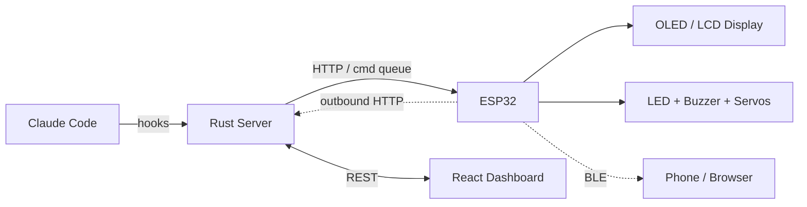

# Hookbot

An ESP32 desk companion that reacts to your dev workflow — animated OLED avatar, LEDs, buzzer, servos, and XP leveling, all driven by [Claude Code](https://docs.anthropic.com/en/docs/claude-code) hooks. Managed via a Rust server and React dashboard. Available as self-hosted or fully hosted SaaS — no port forwarding required.

<p align="left">
  <a href="https://www.buymeacoffee.com/xaxy55">
    
  </a>
</p>



## Features

- **Animated avatar** — 6 emotional states, 8 accessories, customizable face parameters on a 128x64 OLED (or 480x480 LCD)
- **Claude Code integration** — Hooks into tool use, task completion, errors, and builds to trigger real-time reactions
- **XP & leveling** — Earn XP from coding activity, level up your bot, unlock achievements and streaks
- **Analytics dashboard** — Charts for tool usage, coding hours, session trends, and device diagnostics
- **Developer insights** — Flow state detection, burnout early warning, project time tracking, weekly AI digests
- **Multi-device** — Discover and manage multiple hookbots via mDNS, device groups, device-to-device linking
- **OTA updates** — Push firmware over WiFi from the web dashboard, bulk deploy with progress bar
- **BLE provisioning & pairing** — Configure WiFi and claim devices over Bluetooth from the browser
- **Hosted mode** — Cloud-connected devices that only need outbound HTTP — no self-hosting, no port forwarding
- **Sensor & automation** — GPIO framework for buttons, motion, ambient light, and IFTTT-style rule engine
- **Smart home** — Philips Hue / WLED sync, Home Assistant, Spotify, standing desk, Stream Deck integrations
- **Community store** — Browse, share, and install community-created plugins, avatars, and animations
- **Social & multiplayer** — Buddy system, avatar raids, shared streaks, team dashboard, global event wall
- **Voice control** — I2S microphone wake word detection, Claude-powered text-to-speech responses
- **iOS companion** — iPhone + Apple Watch app with live activities, widgets, avatar visits, and social features

## Architecture

| Component | Stack | Location |
|-----------|-------|----------|
| Firmware | C++ / Arduino / PlatformIO | `firmware/` |
| Server | Rust / Axum / SQLite | `server/` |
| Web UI | React 19 / TypeScript / Vite | `web/` |
| iOS App | Swift (iPhone + Watch) | `ios/` |
| Hooks | Node.js (Claude Code integration) | `hooks/` |
| Infrastructure | Terraform (GCE + Cloudflare) | `infra/` |

**By the numbers:** 40 web pages, ~160 API endpoints, 42 route modules, firmware v0.7.0, 7 CI/CD workflows.

See [docs/architecture.md](docs/architecture.md) for system diagrams, data flow, database schema, and the XP system.

## Deployment Modes

### Self-Hosted (LAN)

Run the server on your own machine or home server. Devices communicate directly over your local network via HTTP. Full control, zero cloud dependency.

```
[ESP32] <--LAN HTTP--> [Your Server] <--> [Web Dashboard]
```

### Hosted / SaaS (Cloud)

Devices connect outbound to the public server at `bot.mr-ai.no`. No port forwarding, no tunnels, no self-hosting. Just power on, connect to WiFi, and claim the device with a 6-character code.

```
[ESP32] --outbound HTTPS--> [bot.mr-ai.no] <--> [hookbot.mr-ai.no]
```

**How it works:**
1. Device powers on and registers with the cloud server, receiving a device token and claim code
2. Claim code appears on the device screen (OLED/LCD) and is readable via Bluetooth
3. User enters the claim code on the web dashboard (or scans it via Bluetooth) to pair the device
4. Commands flow through a server-side command queue; the device polls for pending commands
5. Device pushes heartbeats with status — no inbound connections needed

## Quick Start

### Prerequisites

- [Rust](https://rustup.rs/) (for the server)
- [Node.js](https://nodejs.org/) 18+ (for the web UI)
- [PlatformIO](https://platformio.org/) (for firmware)
- An ESP32 board with SSD1306 OLED (or ESP32-4848S040C for LCD)

### 1. Server

```bash
cp .env.example .env  # optional, defaults work fine
cd server && cargo run
```

Environment variables (all optional):
| Variable | Default | Description |
|----------|---------|-------------|
| `DATABASE_URL` | `data/hookbot.db` | SQLite database path |
| `BIND_ADDR` | `0.0.0.0:3000` | Server listen address |
| `POLL_INTERVAL` | `10` | Device polling interval (seconds) |
| `LOG_RETENTION_HOURS` | `24` | Auto-prune logs older than this |
| `ADMIN_PASSWORD` | *(none)* | Optional admin password for auth |
| `ALLOWED_ORIGINS` | *(permissive)* | CORS allowed origins |

### 2. Web UI

```bash
cd web && npm install && npm run dev
```

### 3. Firmware

```bash
cd firmware && pio run -e esp32 --target upload
```

On first boot, the device advertises as `Hookbot-XXYY` over Bluetooth. Open the **Bluetooth Setup** page in the web dashboard (Chrome/Edge) to scan, connect, and send WiFi credentials. The device saves them to flash and reboots.

For cloud/hosted mode, set the management server URL via build flag:

```ini
# platformio.ini
build_flags = -DDEFAULT_MGMT_SERVER='"https://bot.mr-ai.no"'
```

### 4. Claude Code Hooks

Copy `hooks/hookbot-hook.js` and `hooks/hookbot-config.json` to your Claude Code hooks directory. See the [Hook Setup Guide](docs/hooks.md) for configuration options.

### Docker (server + web)

```bash
docker compose up --build
```

The server runs on port 3000, the web UI on port 5173.

## Bluetooth Setup & Pairing

The Bluetooth Setup page in the web dashboard handles both WiFi provisioning and device claiming in one flow:

1. **Scan** — Click "Scan for Hookbot" to discover nearby devices via Web Bluetooth
2. **WiFi** — If the device has no WiFi, enter your network credentials and send them over BLE
3. **Claim** — If the device is a cloud-connected device with a claim code, click "Claim This Device" to link it to your account

BLE stays active on unclaimed cloud devices even after WiFi connects, so you can always discover and pair nearby devices. Once claimed, BLE shuts down to save resources.

You can also claim devices manually on the Devices page by typing the 6-character code shown on the device screen.

## Development

```bash
make help              # Show all available commands
make server            # Start backend dev server
make web               # Start frontend dev server
make build             # Production build (server + web)
make test              # Run Playwright tests
make up                # Docker Compose
make screenshots       # Generate App Store screenshots
make build-testflight  # Archive and upload iOS app to TestFlight
```

## CI/CD & Infrastructure

Deployments are automated via GitHub Actions:

- **Server** — Built and deployed to Google Compute Engine on push to `main`
- **Web UI** — Built and deployed to Cloudflare Pages on push to `main`
- **Infrastructure** — Terraform manages GCE instances, Cloudflare DNS, and tunnel configuration

| Workflow | Trigger | Target |
|----------|---------|--------|
| `deploy-server.yml` | Push to main | GCE (Docker) |
| `deploy-web.yml` | Push to main | Cloudflare Pages |
| `infra.yml` | Manual / infra changes | Terraform apply |
| `docker-push.yml` | Push to main | Container registry |
| `claude-code-review.yml` | PR opened | Code review |
| `screenshots.yml` | Manual | App Store screenshots |

## Documentation

- [Architecture & Diagrams](docs/architecture.md) — System overview, data flow, state machines, DB schema
- [API Reference](docs/api.md) — All REST endpoints for server and device
- [Hook Setup](docs/hooks.md) — Claude Code integration, modes, XP system
- [Firmware Guide](docs/firmware.md) — Building, flashing, WiFi provisioning, pin config
- [Roadmap](ROADMAP.md) — Planned features and project vision

## Contributing

See [CONTRIBUTING.md](CONTRIBUTING.md) for guidelines.

## Security

Hookbot supports two deployment models with different security profiles:

- **Self-hosted (LAN):** The server binds to all interfaces by default and uses configurable CORS. Suitable for local network use. Set `ADMIN_PASSWORD` and restrict `ALLOWED_ORIGINS` if exposing to the internet.
- **Hosted (Cloud):** Devices authenticate with server-issued device tokens (`X-Device-Token` header). Users authenticate with API keys. Claim codes use a reduced charset (no O/0/I/1/L) to avoid confusion. Device tokens are SHA-256 hashed at rest.

## License

[MIT](LICENSE)
