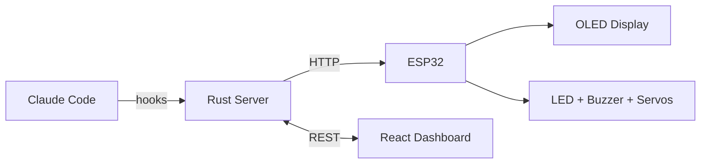

# Hookbot

An ESP32 desk companion that reacts to your dev workflow — animated OLED avatar, LEDs, buzzer, servos, and XP leveling, all driven by [Claude Code](https://docs.anthropic.com/en/docs/claude-code) hooks. Managed via a Rust server and React dashboard.

<p align="left">
  <a href="https://www.buymeacoffee.com/xaxy55">
    
  </a>
</p>



## Features

- **Animated avatar** — 6 emotional states, 8 accessories, customizable face parameters on a 128x64 OLED (or 480x480 LCD)
- **Claude Code integration** — Hooks into tool use, task completion, errors, and builds to trigger real-time reactions
- **XP & leveling** — Earn XP from coding activity, level up your bot, unlock achievements and streaks
- **Analytics dashboard** — Charts for tool usage, coding hours, session trends, and device diagnostics
- **Multi-device** — Discover and manage multiple hookbots via mDNS
- **OTA updates** — Push firmware over WiFi from the web dashboard
- **BLE WiFi provisioning** — No hardcoded credentials, configure WiFi over Bluetooth
- **Sensor & automation ready** — GPIO framework for buttons, motion sensors, and IFTTT-style rules (roadmap)

## Architecture

| Component | Stack | Location | Docs |
|-----------|-------|----------|------|
| Firmware | C++ / Arduino / PlatformIO | `firmware/` | [Firmware Guide](docs/firmware.md) |
| Server | Rust / Axum / SQLite | `server/` | [API Reference](docs/api.md) |
| Web UI | React 19 / TypeScript / Vite | `web/` | |
| iOS App | Swift (iPhone + Watch) | `ios/` | |
| Hooks | Node.js (Claude Code integration) | `hooks/` | [Hook Setup](docs/hooks.md) |

See [docs/architecture.md](docs/architecture.md) for system diagrams, data flow, database schema, and the XP system.

## Quick Start

### Prerequisites

- [Rust](https://rustup.rs/) (for the server)
- [Node.js](https://nodejs.org/) 18+ (for the web UI)
- [PlatformIO](https://platformio.org/) (for firmware)
- An ESP32 board with SSD1306 OLED (or ESP32-4848S040C for LCD)

### 1. Server

```bash
cp .env.example .env  # optional, defaults work fine
cd server && cargo run
```

### 2. Web UI

```bash
cd web && npm install && npm run dev
```

### 3. Firmware

```bash
cd firmware && pio run -e esp32 --target upload
```

On first boot, the device advertises as `DeskBot-XXYY` over Bluetooth. Connect with a BLE app (e.g. nRF Connect) and send your WiFi credentials as `SSID\nPASSWORD`. The device saves them to flash and reboots. See the [Firmware Guide](docs/firmware.md) for details.

### 4. Claude Code Hooks

Copy `hooks/hookbot-hook.js` and `hooks/hookbot-config.json` to your Claude Code hooks directory. See the [Hook Setup Guide](docs/hooks.md) for configuration options.

### Docker (server + web)

```bash
docker compose up --build
```

The server runs on port 3000, the web UI on port 5173.

## Development

```bash
make help     # Show available commands
make server   # Start backend dev server
make web      # Start frontend dev server
make build    # Production build
make test     # Run Playwright tests
make up       # Docker Compose
```

## Documentation

- [Architecture & Diagrams](docs/architecture.md) — System overview, data flow, state machines, DB schema
- [API Reference](docs/api.md) — All REST endpoints for server and device
- [Hook Setup](docs/hooks.md) — Claude Code integration, modes, XP system
- [Firmware Guide](docs/firmware.md) — Building, flashing, WiFi provisioning, pin config
- [Roadmap](ROADMAP.md) — Planned features and project vision

## Contributing

See [CONTRIBUTING.md](CONTRIBUTING.md) for guidelines.

## Security

Hookbot is designed for **local network use**. The server binds to all interfaces by default and uses permissive CORS. Do not expose it to the public internet without adding authentication and restricting CORS origins.

## License

[MIT](LICENSE)
