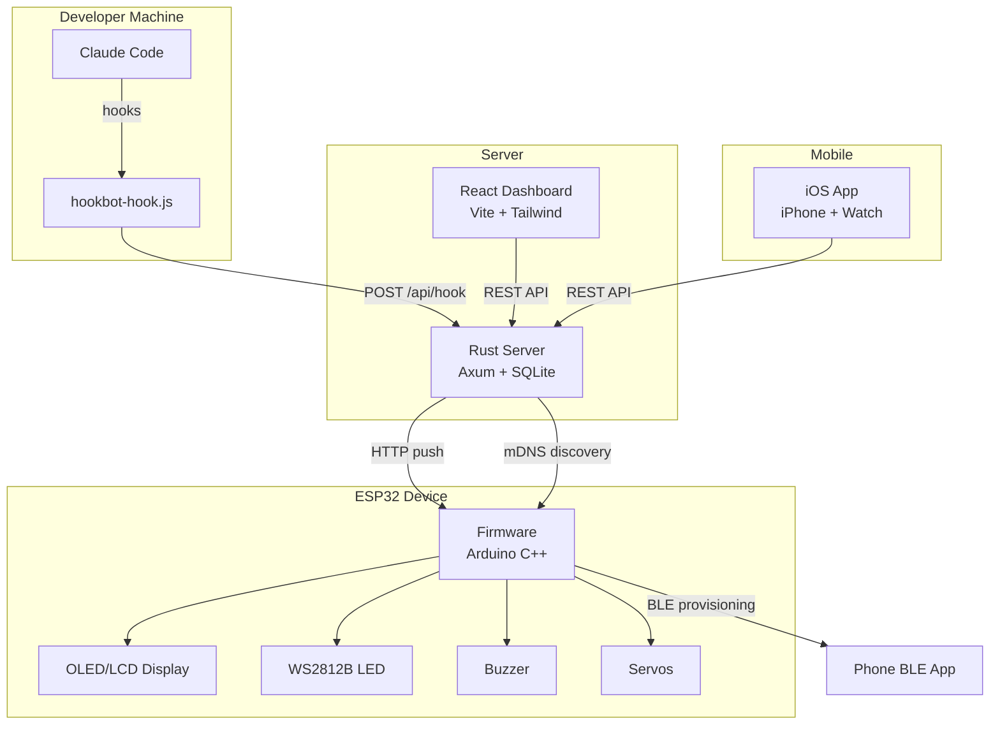
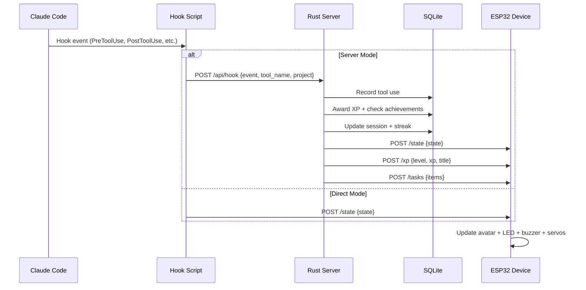
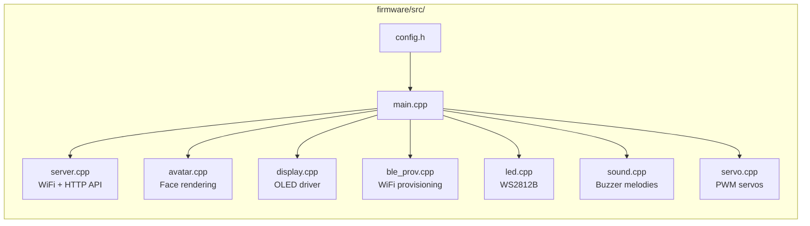
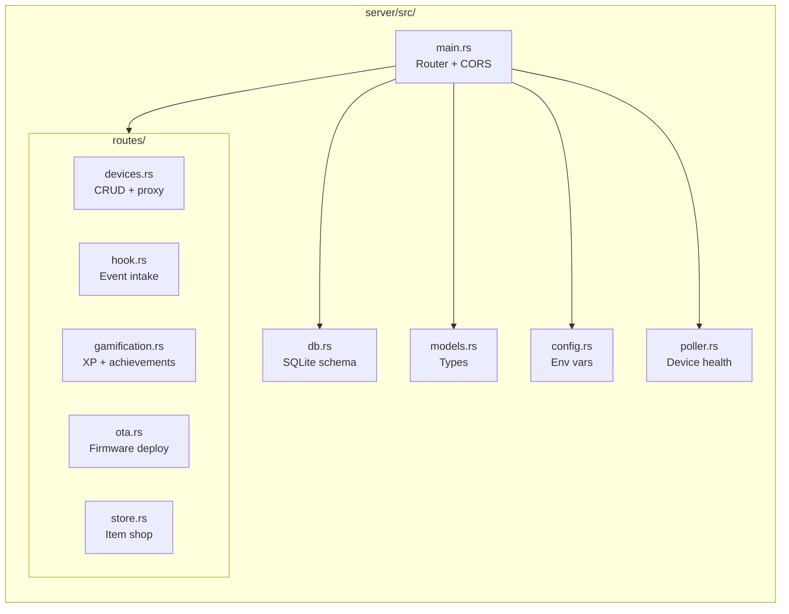
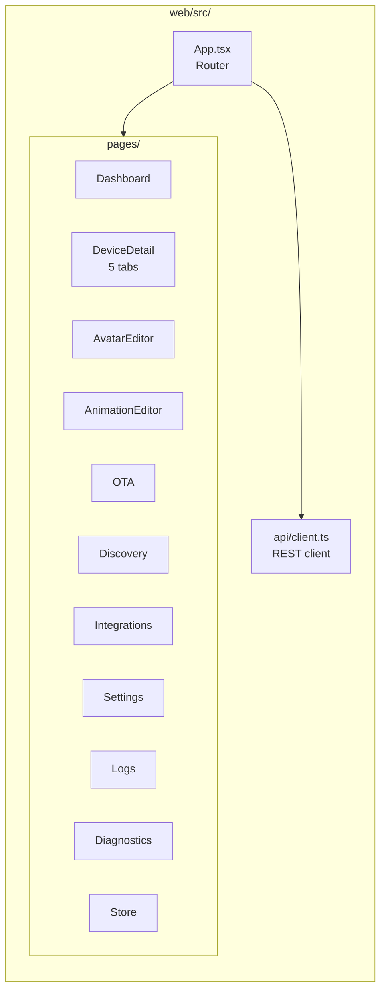
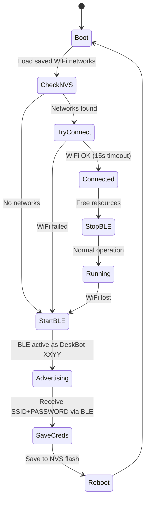
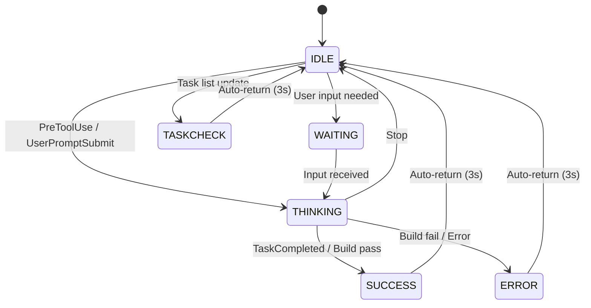
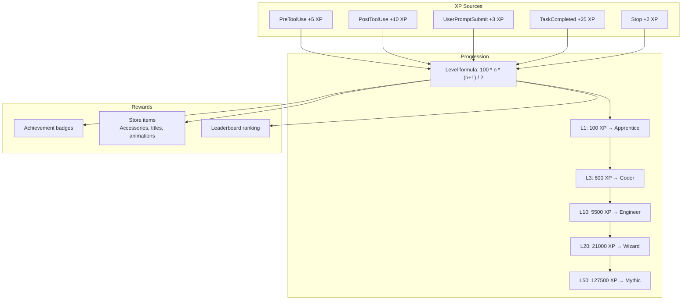
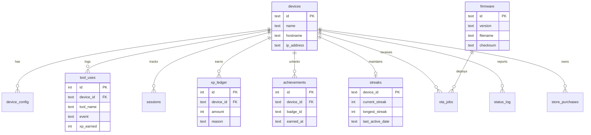

# Architecture

## System Overview

```mermaid
graph TB
    subgraph Developer Machine
        CC[Claude Code] -->|hooks| HK[hookbot-hook.js]
    end

    subgraph Server
        HK -->|POST /api/hook| API[Rust Server<br/>Axum + SQLite]
        WEB[React Dashboard<br/>Vite + Tailwind] -->|REST API| API
    end

    subgraph ESP32 Device
        API -->|HTTP push| FW[Firmware<br/>Arduino C++]
        FW --> OLED[OLED/LCD Display]
        FW --> LED[WS2812B LED]
        FW --> BUZ[Buzzer]
        FW --> SRV[Servos]
    end

    subgraph Mobile
        IOS[iOS App<br/>iPhone + Watch] -->|REST API| API
    end

    API -->|mDNS discovery| FW
    FW -->|BLE provisioning| PHONE[Phone BLE App]
```

## Data Flow

```mermaid
sequenceDiagram
    participant CC as Claude Code
    participant HK as Hook Script
    participant SV as Rust Server
    participant DB as SQLite
    participant DV as ESP32 Device

    CC->>HK: Hook event (PreToolUse, PostToolUse, etc.)

    alt Server Mode
        HK->>SV: POST /api/hook {event, tool_name, project}
        SV->>DB: Record tool use
        SV->>DB: Award XP + check achievements
        SV->>DB: Update session + streak
        SV->>DV: POST /state {state}
        SV->>DV: POST /xp {level, xp, title}
        SV->>DV: POST /tasks {items}
    else Direct Mode
        HK->>DV: POST /state {state}
    end

    DV->>DV: Update avatar + LED + buzzer + servos
```

## Component Architecture

```mermaid
graph LR
    subgraph Firmware["firmware/src/"]
        main[main.cpp] --> server[server.cpp<br/>WiFi + HTTP API]
        main --> avatar[avatar.cpp<br/>Face rendering]
        main --> display[display.cpp<br/>OLED driver]
        main --> ble[ble_prov.cpp<br/>WiFi provisioning]
        main --> led[led.cpp<br/>WS2812B]
        main --> sound[sound.cpp<br/>Buzzer melodies]
        main --> servo[servo.cpp<br/>PWM servos]
        config[config.h] --> main
    end
```

```mermaid
graph LR
    subgraph Server["server/src/"]
        smain[main.rs<br/>Router + CORS] --> routes
        subgraph routes["routes/"]
            devices[devices.rs<br/>CRUD + proxy]
            hook[hook.rs<br/>Event intake]
            gamification[gamification.rs<br/>XP + achievements]
            ota[ota.rs<br/>Firmware deploy]
            store[store.rs<br/>Item shop]
        end
        smain --> db[db.rs<br/>SQLite schema]
        smain --> models[models.rs<br/>Types]
        smain --> config[config.rs<br/>Env vars]
        smain --> poller[poller.rs<br/>Device health]
    end
```

```mermaid
graph LR
    subgraph Web["web/src/"]
        App[App.tsx<br/>Router] --> pages
        subgraph pages["pages/"]
            dash[Dashboard]
            detail[DeviceDetail<br/>5 tabs]
            avatar_ed[AvatarEditor]
            anim[AnimationEditor]
            otap[OTA]
            disc[Discovery]
            integ[Integrations]
            sett[Settings]
            logs[Logs]
            diag[Diagnostics]
            storep[Store]
        end
        App --> api[api/client.ts<br/>REST client]
    end
```

## WiFi Provisioning Flow

```mermaid
stateDiagram-v2
    [*] --> Boot
    Boot --> CheckNVS: Load saved WiFi networks
    CheckNVS --> TryConnect: Networks found
    CheckNVS --> StartBLE: No networks
    TryConnect --> Connected: WiFi OK (15s timeout)
    TryConnect --> StartBLE: WiFi failed
    StartBLE --> Advertising: BLE active as DeskBot-XXYY
    Advertising --> SaveCreds: Receive SSID+PASSWORD via BLE
    SaveCreds --> Reboot: Save to NVS flash
    Reboot --> Boot
    Connected --> StopBLE: Free resources
    StopBLE --> Running: Normal operation
    Running --> StartBLE: WiFi lost
```

## Avatar State Machine

```mermaid
stateDiagram-v2
    [*] --> IDLE
    IDLE --> THINKING: PreToolUse / UserPromptSubmit
    THINKING --> SUCCESS: TaskCompleted / Build pass
    THINKING --> ERROR: Build fail / Error
    THINKING --> IDLE: Stop
    SUCCESS --> IDLE: Auto-return (3s)
    ERROR --> IDLE: Auto-return (3s)
    IDLE --> WAITING: User input needed
    WAITING --> THINKING: Input received
    IDLE --> TASKCHECK: Task list update
    TASKCHECK --> IDLE: Auto-return (3s)
```

## XP & Leveling

```mermaid
graph TD
    subgraph "XP Sources"
        A[PreToolUse +5 XP]
        B[PostToolUse +10 XP]
        C[UserPromptSubmit +3 XP]
        D[TaskCompleted +25 XP]
        E[Stop +2 XP]
    end

    subgraph "Progression"
        F["Level formula: 100 * n * (n+1) / 2"]
        G["L1: 100 XP → Apprentice"]
        H["L3: 600 XP → Coder"]
        I["L10: 5500 XP → Engineer"]
        J["L20: 21000 XP → Wizard"]
        K["L50: 127500 XP → Mythic"]
    end

    subgraph "Rewards"
        L[Achievement badges]
        M[Store items<br/>Accessories, titles, animations]
        N[Leaderboard ranking]
    end

    A & B & C & D & E --> F
    F --> G --> H --> I --> J --> K
    F --> L & M & N
```

## Database Schema

```mermaid
erDiagram
    devices ||--o{ device_config : has
    devices ||--o{ tool_uses : logs
    devices ||--o{ sessions : tracks
    devices ||--o{ xp_ledger : earns
    devices ||--o{ achievements : unlocks
    devices ||--o| streaks : maintains
    devices ||--o{ ota_jobs : receives
    devices ||--o{ status_log : reports
    devices ||--o{ store_purchases : owns
    firmware ||--o{ ota_jobs : deploys

    devices {
        text id PK
        text name
        text hostname
        text ip_address
    }

    tool_uses {
        int id PK
        text device_id FK
        text tool_name
        text event
        int xp_earned
    }

    xp_ledger {
        int id PK
        text device_id FK
        int amount
        text reason
    }

    achievements {
        int id PK
        text device_id FK
        text badge_id
        text earned_at
    }

    streaks {
        text device_id PK
        int current_streak
        int longest_streak
        text last_active_date
    }

    firmware {
        text id PK
        text version
        text filename
        text checksum
    }
```
