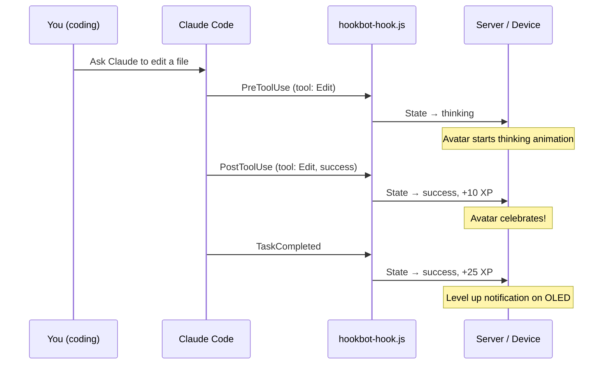

# Claude Code Hook Integration

Hookbot integrates with [Claude Code hooks](https://docs.anthropic.com/en/docs/claude-code) to react to your coding activity in real-time.

## How It Works



## Installation

### 1. Copy hook files

Copy `hooks/hookbot-hook.js` and `hooks/hookbot-config.json` to your Claude Code hooks directory, or reference them from your Claude Code settings.

### 2. Configure

Edit `hookbot-config.json`:

```json
{
  "host": "http://hookbot.local",
  "mode": "server"
}
```

You can also create a `.hookbot` file in any project root to override settings per-project:

```json
{
  "host": "http://hookbot.local",
  "device_id": "specific-device-uuid"
}
```

## Modes

### Server Mode (`"mode": "server"`)

Events are sent to the Rust management server, which:
- Records tool usage in the database
- Awards XP and checks achievement conditions
- Tracks coding sessions and streaks
- Forwards state changes to the device
- Powers the analytics dashboard

**Use this for:** Full gamification, analytics, multi-device setups.

### Direct Mode (`"mode": "direct"`)

Events are sent straight to the ESP32 device over HTTP. No server needed.

The hook maps events to avatar states locally:
- `PreToolUse` / `UserPromptSubmit` → `thinking`
- `PostToolUse` (build/test pass) → `success`
- `Stop` → `idle`
- `TaskCompleted` → `success`

**Use this for:** Simple single-device setups without analytics.

## XP Awards

| Event | XP | When |
|-------|-----|------|
| PreToolUse | +5 | Claude starts using a tool |
| PostToolUse | +10 | Tool use completes |
| UserPromptSubmit | +3 | You send a message |
| TaskCompleted | +25 | Claude finishes a task |
| Stop | +2 | Session ends |

## Achievements

17 badges unlock automatically based on your activity:

| Badge | Condition |
|-------|-----------|
| First Hook | First event received |
| Century | 100 tool calls |
| Night Owl | Coding between midnight and 4 AM |
| Early Bird | Coding between 4 and 6 AM |
| Speed Demon | 10 tools in 5 minutes |
| Streak 7 | 7-day coding streak |
| Streak 30 | 30-day coding streak |
| Shape Shifter | Triggered all avatar states |

...and more. See the Store page in the dashboard for purchasable rewards.
