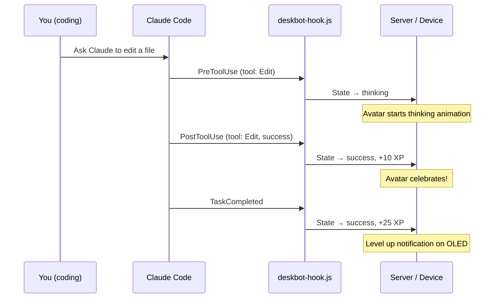

# Claude Code Hook Integration

Hookbot integrates with [Claude Code hooks](https://docs.anthropic.com/en/docs/claude-code) to react to your coding activity in real-time.

## How It Works


```mermaid
sequenceDiagram
    participant You as You (coding)
    participant CC as Claude Code
    participant HK as deskbot-hook.js
    participant SV as Server / Device

    You->>CC: Ask Claude to edit a file
    CC->>HK: PreToolUse (tool: Edit)
    HK->>SV: State → thinking
    Note over SV: Avatar starts thinking animation

    CC->>HK: PostToolUse (tool: Edit, success)
    HK->>SV: State → success, +10 XP
    Note over SV: Avatar celebrates!

    CC->>HK: TaskCompleted
    HK->>SV: State → success, +25 XP
    Note over SV: Level up notification on OLED
```

## Installation

### 1. Install the CLI

From the repo root:

```bash
make install
```

This builds `cli/` in release mode and installs the `hookbot` binary into
`~/.cargo/bin` (override with `make install INSTALL_ROOT=/usr/local`).

### 2. Log in to your server

```bash
hookbot login --url https://your-hookbot-server
```

It checks `/api/health`, exchanges your admin password for an API key, and saves
both to `~/.hookbot` (mode `0600`). If you already have an API key, skip the
password prompt with `hookbot login --url https://your-hookbot-server --key <key>`.

### 3. Wire up the hooks

```bash
hookbot hooks install
```

This writes the `PreToolUse`, `PostToolUse`, `UserPromptSubmit`, and `Stop`
entries into `~/.claude/settings.json`. It **merges** into your existing settings
(other hooks and keys are left alone), backs the file up to
`settings.json.bak.<timestamp>` first, and is idempotent — running it again
replaces the Hookbot entries instead of duplicating them.

| Flag | Effect |
|------|--------|
| `--project` | Write to `./.claude/settings.json` instead of `~/.claude/settings.json` |
| `--settings <path>` | Write to an explicit settings file |
| `--script <path>` | Point at a hook script outside this checkout |
| `--device <id>` | Bind the hooks to one device instead of the first registered one |
| `--json` | Print a machine-readable summary |

Restart Claude Code (or start a new session) to pick the hooks up.

### Hook configuration

`hooks install` also writes the config the hook script itself reads — server
host, mode, API key, and optional device ID:

- user scope → `hooks/hookbot-config.json` (next to the hook script)
- `--project` → `.hookbot` in the project root

Both are gitignored and written `0600` because they can hold an API key. You can
edit them by hand:

```json
{
  "host": "http://hookbot.local",
  "mode": "server",
  "device_id": "specific-device-uuid"
}
```

A `.hookbot` file in a project root always wins over the global config, so you
can point individual projects at a different server or device.

## Modes

### Server Mode (`"mode": "server"`)

Events are sent to the Rust management server, which:
- Records tool usage in the database
- Awards XP and checks achievement conditions
- Tracks coding sessions and streaks
- Forwards state changes to the device
- Powers the analytics dashboard

**Use this for:** Full gamification, analytics, multi-device setups.

### Direct Mode (`"mode": "direct"`)

Events are sent straight to the ESP32 device over HTTP. No server needed.

The hook maps events to avatar states locally:
- `PreToolUse` / `UserPromptSubmit` → `thinking`
- `PostToolUse` (build/test pass) → `success`
- `Stop` → `idle`
- `TaskCompleted` → `success`

**Use this for:** Simple single-device setups without analytics.

## XP Awards

| Event | XP | When |
|-------|-----|------|
| PreToolUse | +5 | Claude starts using a tool |
| PostToolUse | +10 | Tool use completes |
| UserPromptSubmit | +3 | You send a message |
| TaskCompleted | +25 | Claude finishes a task |
| Stop | +2 | Session ends |

## Achievements

17 badges unlock automatically based on your activity:

| Badge | Condition |
|-------|-----------|
| First Hook | First event received |
| Century | 100 tool calls |
| Night Owl | Coding between midnight and 4 AM |
| Early Bird | Coding between 4 and 6 AM |
| Speed Demon | 10 tools in 5 minutes |
| Streak 7 | 7-day coding streak |
| Streak 30 | 30-day coding streak |
| Shape Shifter | Triggered all avatar states |

...and more. See the Store page in the dashboard for purchasable rewards.
